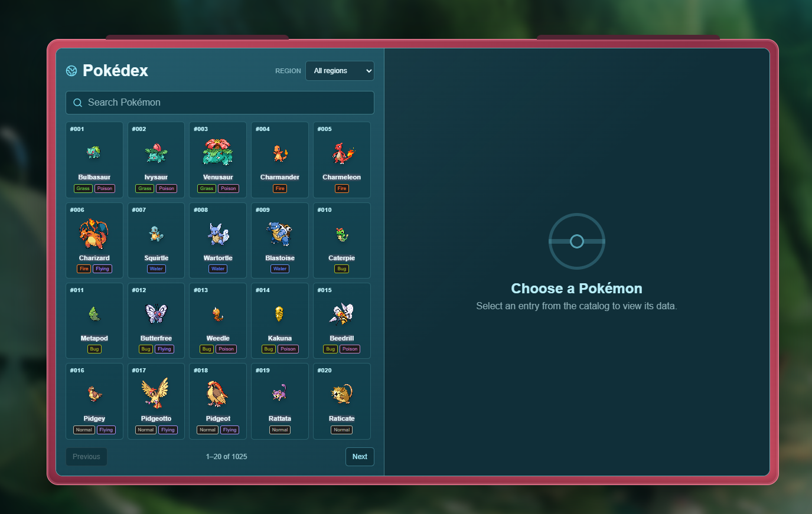

# Poketip

A Pokémon team-building single-page app with an AI assistant, grounded in verified
[PokéAPI](https://pokeapi.co) data.

[**Live demo**](https://poketip.vercel.app) · [Report an issue](https://github.com/hey-Lyn/poketip/issues)



## Overview

Poketip is an ongoing project with the idea of being a website for Pokémon enthusiasts to get their info from, and also build their own teams.
I'm sure that sounds too generic, what differentiates the project though is the presence of its own AI system, which receives a ton of information and tests so it minimizes the hallucination LLMs tend to have.
At this stage, the AI can both explain info about a specific pokémon (it has access to competitive data!), and also automatically build your pokémon team from scratch or with personalized instruction! it can even be shared to Pokémon Showdown

## Features

- **Pokédex** — browse and search every Pokémon with types, base stats, evolution
  and encounter data.
- **Team Builder** — build a party of up to six Pokémon with full competitive sets
  (nature, EVs, IVs, moves, item, ability, tera type) and live team analysis.
- **AI assistant** — ask about a specific Pokémon or your whole team. The server
  re-verifies every Pokémon/species/move through PokéAPI before the model answers,
  and it can propose validated team edits that you apply explicitly.
- **Campaign guide** — grounded guidance for Pokémon Emerald and FireRed milestones. (WIP)
- **Trainer profiles** — opt in to the signed-in trainer directory, choose a
  unique username, and explore other trainers' bios and favorite Pokémon.
  
## Tech stack

- **Frontend:** React 19, React Router, Vite
- **Language:** TypeScript (`strict` off), including serverless functions and tests
- **Backend:** Vercel serverless functions (`/api`)
- **Data:** Supabase (Postgres + Auth + Storage), PokéAPI, Pokémon Showdown data
  (`@pkmn/dex`)
- **AI:** OpenRouter (server-side only)
- **Tests:** Vitest + Testing Library

## Getting started

### Prerequisites

- Node.js 24+ (the `scripts/*.ts` tooling runs via Node's native type stripping)
- A [Supabase](https://supabase.com) project
- An [OpenRouter](https://openrouter.ai) API key

### Setup

1. Install dependencies:

   ```bash
   npm install
   ```

2. Copy `.env.example` to `.env.local` and fill it in:

   - `VITE_SUPABASE_URL` and `VITE_SUPABASE_ANON_KEY` — public, safe for the browser.
   - `SUPABASE_URL` — server only; use the same Project URL as `VITE_SUPABASE_URL`.
   - `SUPABASE_SERVICE_ROLE_KEY` — server only; never expose it to the browser.
   - `OPENROUTER_API_KEY` and `OPENROUTER_MODEL` — server only.
   - `AI_DAILY_LIMIT` (optional, default `7`) and `AI_CREDIT_COST` (optional,
     default `1`).
   - `AI_IP_DAILY_LIMIT` (optional, default `14`) — caps requests per network.

3. Run the SQL migrations in the Supabase SQL editor, in order:

   ```text
   supabase/migrations/0001_ai_usage.sql
   supabase/migrations/0002_profiles.sql
   supabase/migrations/0003_roles.sql
   supabase/migrations/0004_profile_security.sql
   supabase/migrations/0005_ip_usage.sql
   supabase/migrations/0006_social_profiles.sql
   ```

4. Configure auth in Supabase Dashboard → Authentication → URL Configuration:
   - **Site URL**: your production origin (e.g. `https://your-app.vercel.app`).
   - **Redirect URLs**: add your production origin and `http://localhost:5173` for
     local development.

   Also enable email sign-up under Authentication → Providers → Email. This matters
   because the confirmation email link uses these URLs: if **Site URL** is left at
   the default `http://localhost:3000`, new users opening the link see a
   "localhost doesn't exist" browser error.

   The built-in Supabase email service only sends a few confirmation emails per
   hour and is not meant for production. If sign-up fails with "Too many
   confirmation emails...", either wait before retrying or, for real traffic,
   configure your own SMTP under Authentication → Emails → SMTP Settings.

5. Run the app:

   ```bash
   npm run dev:full   # Vite + the /api functions (loads .env.local)
   ```

   `npm run dev` runs Vite only; the `/api` routes will not work.

### Scripts

| Command | Description |
| --- | --- |
| `npm run dev` | Vite dev server only |
| `npm run dev:full` | Vite + serverless functions locally |
| `npm test` | Run the test suite |
| `npm run lint` | ESLint |
| `npm run typecheck` | TypeScript type check (`tsc --noEmit`) |
| `npm run build` | Production build |
| `npm run test:ai` | Hit a running `dev:full` server as a signed-in user |

## Architecture

- `src/` — React SPA (entry `src/main.tsx`, routes in `src/App.tsx`).
- `src/services/` — browser-side data/API services (PokéAPI, Showdown, Supabase,
  team storage, settings).
- `api/` — Vercel serverless functions; shared logic in `api/_lib/`.
- `src/types.ts` — shared domain types (`TeamMember`, `Team`, `PokemonLite`, ...).
- `supabase/migrations/` — database schema, RLS policies and functions.

### Trainer profiles

Apply `0006_social_profiles.sql` before deploying the trainer pages. Existing
accounts stay private: sign in, open **Profile**, choose a username (3–24 lowercase
letters, numbers or underscores, starting with a letter or number), enable
**Show my profile to other trainers**, and save. **View my trainer profile** opens
your shared page. Disable the checkbox and save to remove your profile from the
directory and direct profile lookups; your username stays reserved.

**Trainers** (`/trainers`) searches shared profiles by name or username, with
pagination and compact rows showing a short bio, favorite Pokémon and an explicit
**View profile** action. Your own row is marked **You**. `/trainers/:username`
shows a read-only trainer card with the full bio and membership date. Both require sign-in.
Owner-only `profiles` RLS remains in place; authenticated-only database functions
return a fixed set of social fields, excluding email, AI credits and roles. No
existing email is used to generate a username or fill a shared display name.

**Messages** (`/messages`) lists chats and received requests. **Request conversation**
on another trainer's profile opens an invitation; only the recipient can accept
or decline it. Sending remains locked until acceptance, including in the database.
The sender can cancel a pending request, and either participant can block a
conversation. Blocked conversations retain their history and cannot receive new
messages. Declined/canceled requests cannot be sent again in this first version.

Text messages support 2,000 characters, Enter to send and Shift + Enter for a
new line. The inbox shows unread counts, search and last-message previews. History
loads 50 messages at a time, with **Load older messages** for earlier pages.
The interface uses two columns on desktop and one screen at a time on mobile.
Realtime updates use participants-only SELECT policies; a visible-page refresh
every 30 seconds and refresh-on-focus recover changes during reconnection.

Apply `supabase/migrations/0009_trainer_messages.sql` after `0008` to enable real
chat. Both users must enable their shared trainer profiles. Browser clients can
only SELECT their conversations/messages; authenticated RPCs control requests,
acceptance, blocking, sending and read receipts. Limits are 10 new requests/hour
and 30 sent messages/minute per account. Social functions never expose email,
credits or account roles. `supabase/tests/0009_trainer_messages.sql` checks consent,
participant isolation, direct-write restrictions, unread state and blocking;
run it as postgres after the migrations (its fixtures are rolled back).

Trainer customization adds a title, RGB color pickers for the card frame and
the two ends of its background gradient, uploaded covers,
a favorite game and a featured team of up to six
Pokémon. The profile editor shows a live preview. You can search for team members,
remove them or copy a snapshot from Team Builder; profile edits do not modify the
battle team. Save profile to publish these changes when sharing is enabled.

Click the profile photo or banner to choose an image (PNG/JPG/WebP/GIF up to
10 MB). A crop dialog lets you drag, zoom with the slider or mouse wheel over the image, rotate or adjust position with arrow
keys, with a reset control to restore the original framing. Apply updates the photo or prepares the banner; save profile to
keep the banner. Cancel leaves the existing image unchanged. Crops are exported
as still WebP images (512×512 for photos, 1500×600 for banners), under the existing
2 MB storage limit. GIF animation is not preserved. Banner presets and separate
upload/remove controls are no longer shown.

For real accounts, apply `supabase/migrations/0007_trainer_customization.sql` after
`0006_social_profiles.sql`, then `0008_trainer_card_colors.sql` for custom RGB colors,
in the Supabase SQL editor. Existing profile editing
continues to work until setup is complete. Covers use the existing public avatars
bucket and owner-folder upload policies. The database keeps owner-only profile
access and only exposes these fields through the signed-in social functions.

The transactional permission checks in `supabase/tests/0006_social_profiles.sql`
can be run as `postgres` against a local/disposable database after all migrations.
They roll back their fixtures and cover private profiles, anonymous access,
social-only result fields, username constraints, owner-only writes, and protected
credits/roles. Browser services and pages have colocated Vitest tests.

### AI and security

The browser never sees the OpenRouter key or model choice, and it cannot send
system instructions. Every AI request requires a signed-in session and is rate
limited per user per day and per client IP, so creating many accounts from one
network cannot bypass the limit. Beyond the free daily limit a request spends
server-owned credits. Profile `credits` and `role` are protected by column-level
grants and a database trigger, and the credit/usage RPCs are executable only by
the service role.

## Deployment

The app deploys to [Vercel](https://vercel.com). Set the same environment
variables in the project settings and connect the repository for automatic
deploys. A `vercel.json` rewrite keeps client-side routes working on refresh.

## License

[MIT](LICENSE)
