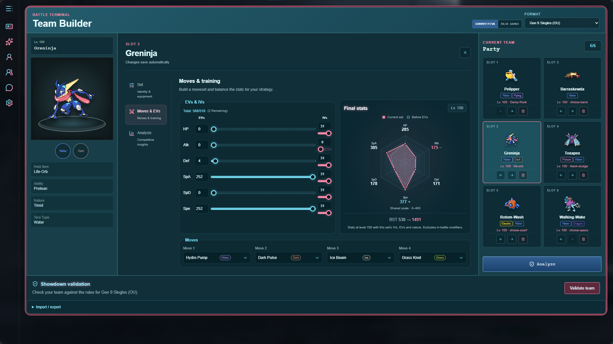
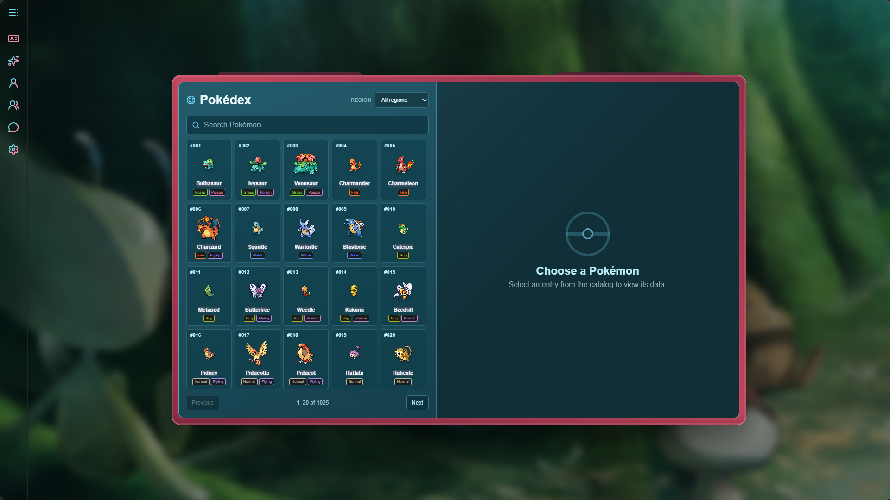
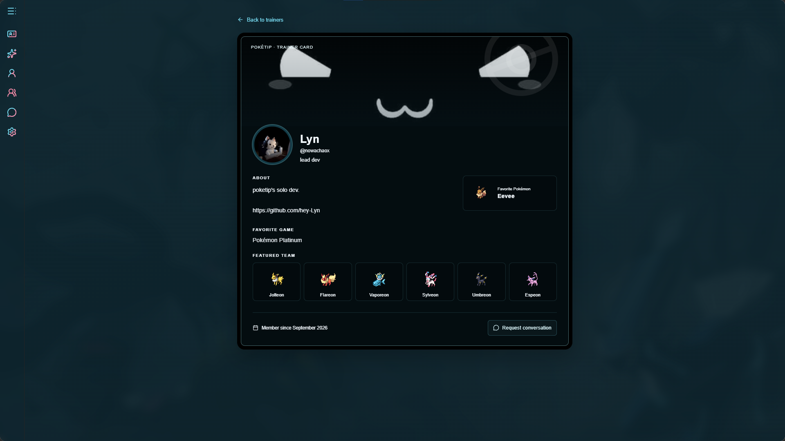
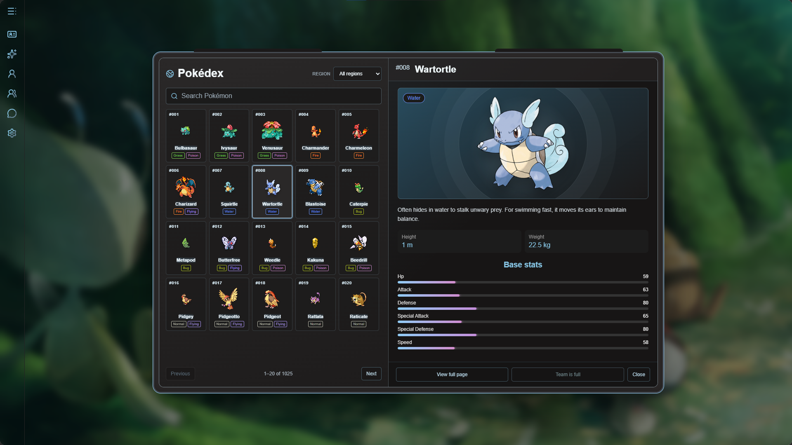

# Poketip

A Pokémon team-building single-page app with an AI assistant, grounded in verified
[PokéAPI](https://pokeapi.co) data.

[**Live demo**](https://poketip.vercel.app) · [Report an issue](https://github.com/hey-Lyn/poketip/issues)

## Overview

Poketip is an ongoing project with the idea of being a website for Pokémon enthusiasts. It's main reasons to use are the Pokedéx with competitive data and the team building with AI assistance 
which receives a ton of information and tests so it minimizes the hallucination LLMs tend to have.
At this stage, the AI can both explain info about a specific pokémon (it has access to competitive data!), and also automatically build your pokémon team from scratch or with personalized instruction. it can even be shared to use in Pokémon Showdown.

## Screenshots

Click any screenshot to open it at full size.

<table>
  <tr>
    <td align="center"> <strong>Team Builder</strong></td>
    <td align="center"> <strong>Pokédex</strong></td>
  </tr>
  <tr>
    <td align="center"> <strong>Trainer profile</strong></td>
    <td align="center"> <strong>Pokémon details</strong></td>
  </tr>
</table>

## Features

- **Pokédex** — browse and search every Pokémon with types, base stats, evolution
  encounter data, competitive stats...
- **Team Builder** — build a party of up to six Pokémon with full competitive sets
  (nature, EVs, IVs, moves, item, ability, tera type) and live team analysis.
- **Showdown validation** — check the exported team against the Pokémon Showdown
  engine's rules for the selected competitive format.
- **AI assistant** — ask about a specific Pokémon or your whole team. The server
  re-verifies every Pokémon/species/move through PokéAPI before the model answers,
  and it can propose validated team edits that you apply explicitly.
- **Campaign guide** — grounded guidance for Pokémon Emerald and FireRed milestones. (WIP)
- **Trainer profiles** — opt in to the signed-in trainer directory, choose a
  unique username, and explore other trainers' bios and favorite Pokémon.
- **Messages** — accept chat requests, reply, edit your messages, search history,
  and make one-to-one voice calls with screen sharing.
  
## Tech stack

- **Frontend:** React 19, React Router, Vite
- **Language:** TypeScript with strict null checking, including serverless functions and tests
- **Backend:** Vercel serverless functions (`/api`)
- **Data:** Supabase (Postgres + Auth + Storage), PokéAPI, Pokémon Showdown data
  (`@pkmn/dex`)
- **AI:** OpenRouter (server-side only)
- **Tests:** Vitest + Testing Library

### AI and security

The browser never sees the OpenRouter key or model choice, and it cannot send
system instructions. Every AI request requires a signed-in session and is rate
limited per user per day and per client IP, so creating many accounts from one
network cannot bypass the limit. Beyond the free daily limit a request spends
server-owned credits. Profile `credits` and `role` are protected by column-level
grants and a database trigger, and the credit/usage RPCs are executable only by
the service role.

## License

[MIT](LICENSE)
